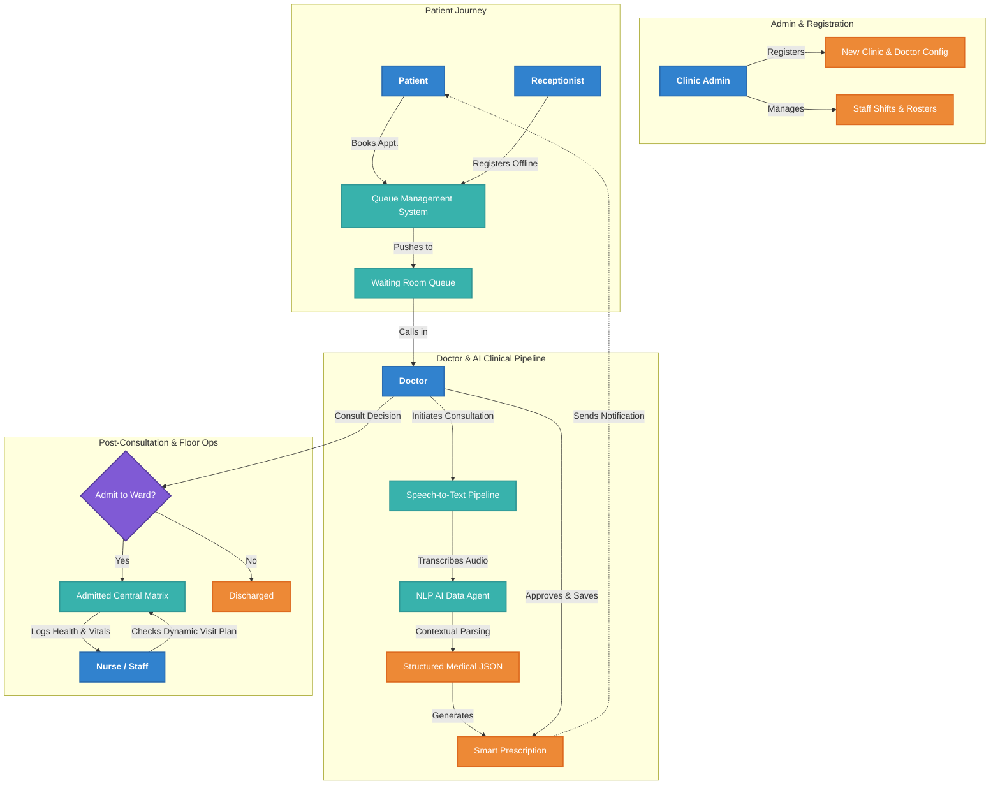

<div align="center">
  
  <h1 align="center">MedAssist AI Suite</h1>
  
  <p align="center">
    <strong>A Next-Generation, AI-Powered Healthcare Clinic Management System</strong>
  </p>
  
  <p align="center">
    
    
    
    
    
  </p>
</div>

---

## 🚀 Overview

**MedAssist AI Suite** is a comprehensive, multi-role hospital and clinic management platform designed to bridge the gap between healthcare professionals and patients. It significantly reduces administrative overhead and relies on cutting-edge **Generative AI** and **Voice-to-Text** capabilities to auto-generate prescriptions, analyze lab reports, and logically map doctor visitation plans.

Whether you're operating a small boutique clinic or a sprawling multi-specialty hospital, MedAssist AI ensures every stakeholder has exactly the tools they need.

---

## 📊 System Architecture & Patient Flow

The platform dictates a robust pipeline mapping operations from initial patient registration to smart-AI medical data parsing. Let's visualize the architecture:



---

## ✨ Core Features by Role

The platform implements rigorous **Role-Based Access Control (RBAC)** to deliver targeted, distraction-free dashboards:

### 🏥 Clinic Admin
* **Global Oversight:** Register new clinics and manage all staff members securely. 
* **Real-time Metrics:** Monitor total patient inflows, staff shifts, active doctors, and overall hospital efficiency.
* **Patient-Doctor Mapping:** Get a bird's-eye view tracking patients specifically dynamically mapped to the doctors treating them.

### 🩺 Doctor
* **AI Voice Consultations:** Conduct consultations using a live AI transcription tool that automatically extracts medication names, dosages, and durations.
* **Smart Prescriptions:** One-click generate smart prescriptions from voice data with automated reminders seamlessly piped to the patient.
* **Shift & Staff Control:** Manage work schedules, admit/discharge patients directly from the queue, and oversee ward resources.
* **AI Medical Assistant:** Quick queries for symptom checking or querying drug interactions via the localized AI Chat.

### 👤 Patient
* **Intelligent Appointment Booking:** Find and book specific doctors within clinics, viewing accurate consultation fees, geolocation, and user-driven ratings.
* **Health Tracking & Medications:** Real-time visibility of prescribed medication, automatic dosage guidelines (e.g., "5ml of Syrup", "1 Tablet"), and nearest available pharmacies.
* **AI Health Guide:** Patients can upload PDFs or Images of their medical reports to receive non-diagnostic guidance, condition breakdowns, and directed recommendations.

### 📋 Receptionist
* **Queue & Flow Management:** Complete control over adding, updating, and removing patients.
* **Lock-tight Constraints:** To preserve data integrity, patient records and queue positions automatically lock once a doctor begins the medical consultation.

### 👩‍⚕️ Nurse / Ward Staff
* **Time-Enforced Access:** Strict working-hour boundaries ensure patient data is only accessible to nurses on-shift (with overtime overrides strictly managed by doctors).
* **AI Visit Planning:** Nurses receive an AI-generated daily visitation plan coordinating doctor rounds for efficiency.
* **Vitals & Critical Status:** Mark admitted patients with priority tags and specific sub-conditions visible to the entire medical squad.

---

## 🤖 AI Superpowers

1. **Auto-Extracting Prescriptions:** The system listens and recognizes *context* (e.g., turning "Take some aspirin every night for a week" into structured medical JSON data).
2. **Vision & Document Analysis:** The patient AI chatbot handles direct multimedia input (PDF Lab results, X-Ray images) to provide contextual health guidance.
3. **Automated Doctor Rounds:** AI balances patient priority, location, and doctor availability to dynamically generate the best ward-visit schedule.

---

## 🎙️ In-Depth: Speech-to-Text Clinical Agent

The standout feature of the MedAssist AI Suite is the real-time, bidirectional **Speech-to-Text Clinical Agent** embedded directly into the Doctor's consultation dashboard.

### How It Works:
1. **Real-time Audio Capture:** During a patient consultation, the doctor initiates a session via the **Transcript Panel**. The system securely captures the audio stream using the browser's native `MediaRecorder` API.
2. **Speech Transcription (STT):** The raw audio (`.webm` or `.webm/opus`) is seamlessly piped to the backend server via the `speechApi`. The backend leverages advanced, highly fine-tuned Speech-to-Text deep neural network models to convert conversational spoken dialogue into highly accurate text transcripts.
3. **Medical Natural Language Processing (NLP):** Once the raw textual transcript is aggregated, it is instantly passed into the specialized `agentApi`. A custom-prompted Large Language Model (LLM) strictly parses the text looking for actionable medical context:
   * **Contextual Diagnosis:** Understanding the ailment discussed during the visit.
   * **Medical Entities Identification:** Recognizing specific generic or brand name drugs (e.g., "Amoxicillin", "Cough Syrup").
   * **Granular Posology Mapping:** The LLM effortlessly transforms conversational instructions—like *"take 5ml of the syrup twice a day for a week"* or *"take 1 tablet every morning"*—into strict JSON structural schemas: 
     `{ "medicine": "Cough Syrup", "dosage": "5ml", "frequency": "twice a day", "duration": "1 week" }`.
4. **Validation & Safety Pipeline:** The intelligence doesn't stop at extraction. The AI actively scores the result for anomalies—ensuring that dosages align with standard practices and highlighting conflicts via a `warnings` array if critical directions are missing from the conversation.
5. **One-Click Execution:** The final validated output is rendered synchronously in front of the doctor as visually grouped cards. Standardized, error-free prescriptions are published directly to the connected patient's dashboard with just a single click.

---

## 🛠️ Technology Stack

**Frontend Ecosystem:**
* [React](https://reactjs.org/) + [Vite](https://vitejs.dev/) - Lightning fast development and building.
* [TypeScript](https://www.typescriptlang.org/) - End-to-end type safety.
* [TailwindCSS](https://tailwindcss.com/) - Responsive, rapid, and modern utility-first styling.
* [Framer Motion](https://www.framer.com/motion/) - Buttery-smooth, premium user interface animations.
* [Lucide Icons](https://lucide.dev/) - Beautifully crafted UI icons.

**Backend Ecosystem:**
* [Node.js](https://nodejs.org/en/) & [Express](https://expressjs.com/) - Scalable, event-driven API structuring.
* [MongoDB](https://www.mongodb.com/) & [Mongoose](https://mongoosejs.com/) - NoSQL data models for patients, shifts, and medical records.
* **JSON Web Tokens (JWT)** - Secure, stateless RBAC authentication.
* **Generative AI Integration** - Specialized endpoints for vision parsing and LLM orchestration.

---

## ⚙️ Getting Started

First, ensure you have `Node.js` and `npm` installed.

### 1. Clone the Repository
```bash
git clone https://github.com/your-username/medassist-ai-suite.git
cd medassist-ai-suite
```

### 2. Configure Environment Variables
Navigate to both root and `backend/` directories, copy the `.env.example` files to `.env`, and populate your API URLs, Database URIs, and LLM access keys.

### 3. Start the Backend
```bash
cd backend
npm install
npm run dev
```

### 4. Start the Frontend
Open a new terminal session in the root workspace directory.
```bash
npm install
npm run dev
```
The application will be accessible at `http://localhost:5173`.

---

## 📁 Repository Structure

```text
/medassist-ai-suite
├── /backend
│   ├── /controllers     # Logic for Auth, Prescriptions, Admin
│   ├── /models          # Mongoose Schema Definitions 
│   ├── /routes          # Express Routing configurations
│   ├── /middleware      # JWT validation and Role validation
│   └── /ai              # Generative AI adapters & Prompts
├── /src
│   ├── /components      # Sharable UI (AIChat, Dashboards, Tables)
│   ├── /pages           # Distinct views (NurseDashboard, Landing, Consultation)
│   ├── /lib             # Mock Data, API wrappers, Theme Handlers
│   └── App.tsx          # Main React Router hub for role navigation
└── package.json         # Workspace Configuration
```

---


# mediassistai

# mediassistai

